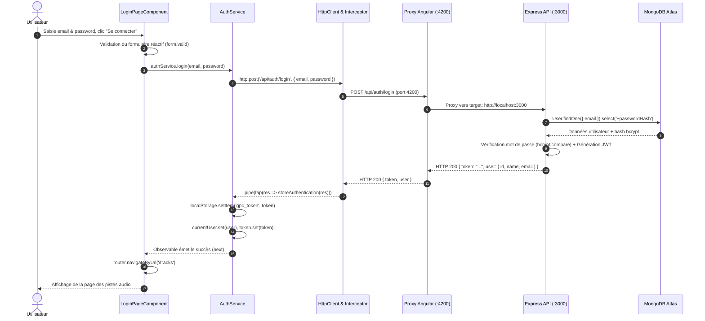

# Rapport d'usage de l'IA — TP1

## Informations générales
- **Binôme :** Binôme Étudiant M1 MIAGE
- **Projet :** Guitar Practice Cloud (GPC) — Architecture Authentification et Profil
- **Assistant IA & Modèle utilisé :** Assistant de développement Antigravity / Gemini 3.8 Flash (High reasoning)
- **Mode d'utilisation :** Agent IDE avec accès direct au workspace, terminal, analyse de fichiers et tests

---

## Mission 0 — Cartographier l'application

### 1. Objectif
Comprendre l'architecture globale d'une application Angular 22 standalone, identifier les composants clés, les routes, l'injection de dépendances, le client HTTP et distinguer les routes publiques des routes protégées sans altérer le code initial.

### 2. Prompt principal
> "Analyse l'architecture du projet Angular fourni dans `frontend-starter` et du backend Express dans `backend`. Retrouve :
> 1. Le composant racine ;
> 2. La configuration des routes ;
> 3. L'enregistrement de HttpClient et des intercepteurs ;
> 4. Les modèles, services et composants de page ;
> 5. Le mécanisme injectant le JWT dans les requêtes ;
> 6. Distingue les routes publiques des routes protégées selon `API_CONTRACT.md` ;
> 7. Produis un schéma Mermaid complet du flux lors du clic sur 'Se connecter'."

### 3. Plan proposé par l'agent
1. Examiner `frontend-starter/src/main.ts` pour repérer `bootstrapApplication`, `provideRouter` et `provideHttpClient`.
2. Examiner `frontend-starter/src/app/routes.ts` pour analyser les routes, les redirections et les guards (`authGuard`).
3. Examiner l'intercepteur `auth.interceptor.ts` et le service `auth.service.ts`.
4. Analyser les routes backend dans `backend/src/app.js` et le contrat d'API dans `API_CONTRACT.md`.
5. Générer le schéma annoté du cycle de vie d'une requête de login.

### 4. Vérifications réalisées par le binôme
- Vérification manuelle de `main.ts` : `AppComponent` est bien le composant racine démarré avec `provideHttpClient(withInterceptors([authInterceptor]))`.
- Vérification du fichier de routes : `routes.ts` protège `/profile` et `/tracks` à l'aide de `canActivate: [authGuard]`.
- Vérification du contrat API :
  - **Routes publiques (sans token) :**
    - `GET /api/health`
    - `POST /api/auth/register`
    - `POST /api/auth/login`
  - **Routes protégées (en-tête `Authorization: Bearer <token>`) :**
    - `GET /api/users/me`
    - `PUT /api/users/me`
    - `GET /api/tracks`
    - `POST /api/tracks`
    - `GET /api/tracks/:id/audio`
    - `DELETE /api/tracks/:id`

### 5. Schéma annoté du flux de connexion (Mission 0)



---

## Mission 1 — Inscription, Connexion et Profil

### 1. Objectif
Compléter et fiabiliser la couche utilisateur du frontend Angular :
- Formulaires réactifs avec validation client et retours visuels explicites.
- Appels API typés via `AuthService` injecté (`inject()`).
- Sauvegarde sécurisée du token JWT dans `localStorage` sans log sensible.
- Gestion d'état réactive via les Signals Angular (`currentUser`, `token`).
- Ajout d'un bouton et d'un mécanisme de déconnexion (`logout`) avec purge du `localStorage` et des Signals.
- Chargement automatique du profil (`GET /api/users/me`) et mise à jour (`PUT /api/users/me`).
- Interception globale des erreurs `401 Unauthorized` pour déconnecter et rediriger vers `/login`.

### 2. Prompt principal
> "Mets en œuvre toutes les exigences de la Mission 1 :
> 1. Formulaires réactifs pour Register et Login avec messages d'erreur clairs et validation du mot de passe (minimum 8 caractères exigé par le backend) ;
> 2. Gestion de l'état d'authentification réactif avec Signals (`currentUser`, `token`) ;
> 3. Ajout d'un bouton de déconnexion visible avec nettoyage de l'état local dans la barre de navigation et dans `AuthService` ;
> 4. Chargement et mise à jour du profil utilisateur avec notifications de succès/erreur ;
> 5. Gestion des erreurs 401 dans l'intercepteur HTTP pour rediriger automatiquement vers `/login` ;
> 6. Respect strict de la séparation des responsabilités : composant -> service -> HttpClient."

### 3. Plan proposé par l'agent
1. **`auth.interceptor.ts`** :
   - Ajouter la capture des erreurs HTTP avec `catchError`.
   - Si `status === 401` et que la requête ne cible pas `/api/auth/login`, appeler `auth.logout()` et naviguer vers `/login`.
2. **`auth.service.ts`** :
   - Injecter le `Router`.
   - Initialiser et synchroniser le profil au démarrage si un token réside déjà dans `localStorage`.
   - Compléter `logout()` pour réinitialiser les signaux, vider le stockage local et rediriger.
3. **`app.ts` / `app.html`** :
   - Injecter `AuthService` dans `AppComponent`.
   - Rendre la barre de navigation dynamique (`@if (auth.token())` : afficher lien Profil, nom de l'utilisateur et bouton Déconnexion ; `@else` : afficher Connexion et Inscription).
4. **`profile-page.ts` / `profile-page.html`** :
   - Implémenter le hook `OnInit` pour charger automatiquement le profil à l'arrivée sur la page.
   - Ajouter des Signals de messages (`message`, `error`) pour confirmer la sauvegarde du nouveau nom.
5. **`login-page` & `register-page`** :
   - Ajouter les retours visuels pour les champs invalides (`required`, `email`, `minlength(8)`).
   - Désactiver le bouton de soumission si le formulaire est invalide (`[disabled]="form.invalid"`).
6. **`styles.css`** :
   - Ajouter le style pour `.btn-logout`, `.field-error` et `.success`.

### 4. Vérifications réalisées par le binôme
1. **Compilation et Build :** Exécution de `npm --prefix frontend-starter run build` -> Succès (code de retour 0, bundle généré en 2.16s).
2. **Tests backend :** Exécution de `npm --prefix backend test` -> 2/2 tests passés avec succès (`GET /api/health` et schémas Mongoose).
3. **Contrôle de sécurité :** Aucun token ni mot de passe n'apparaît dans les logs de la console (`console.log` / `console.debug`). Seuls les statuts et les identifiants publics sont tracés.
4. **Validation du mot de passe :** Le formulaire d'inscription bloque immédiatement la soumission si le mot de passe fait moins de 8 caractères, évitant un aller-retour réseau 400 inutile vers le backend.

### 5. Erreurs ou propositions rejetées
- **Rejet d'une redirection aveugle sur toute 401 :** L'agent a initialement vérifié si toute erreur 401 devait déclencher `auth.logout()`. Proposition ajustée : lorsque l'utilisateur se trompe de mot de passe sur `/api/auth/login`, le backend renvoie 401 (`Identifiants incorrects`). Il ne faut pas déclencher une redirection/déconnexion en boucle dans ce cas, mais laisser `LoginPageComponent` afficher le message d'erreur à l'utilisateur. La condition `!request.url.includes('/api/auth/login')` a donc été explicitement ajoutée.

### 6. Fichiers effectivement modifiés
- `frontend-starter/src/app/shared/interceptors/auth.interceptor.ts` : Gestion du code HTTP 401 et redirection.
- `frontend-starter/src/app/shared/services/auth.service.ts` : Restauration du profil au démarrage, navigation sur déconnexion.
- `frontend-starter/src/app/components/app/app.ts` : Injection d'`AuthService` et méthode `logout()`.
- `frontend-starter/src/app/components/app/app.html` : Navigation réactive et bouton de déconnexion.
- `frontend-starter/src/app/components/profile-page/profile-page.ts` : `OnInit`, notifications réactives de succès/erreur.
- `frontend-starter/src/app/components/profile-page/profile-page.html` : Formulaire réactif de profil, retours visuels.
- `frontend-starter/src/app/components/login-page/login-page.html` : Messages d'erreur de validation pour email et mot de passe.
- `frontend-starter/src/app/components/register-page/register-page.ts` : Validation `Validators.minLength(8)`.
- `frontend-starter/src/app/components/register-page/register-page.html` : Messages de validation du formulaire d'inscription.
- `frontend-starter/src/styles.css` : Classes CSS `.btn-logout`, `.field-error`, `.success`.

---

## Réponses aux questions techniques du TP1

### 1. Différence entre Signal et `localStorage`
- **Signal (Angular) :** Valeur réactive hébergée en **mémoire vive (RAM)** pendant le cycle de vie de l'application JavaScript. Lorsqu'un signal change (ex: `currentUser.set(...)`), Angular notifie automatiquement les composants et les templates dépendants pour mettre à jour le DOM sans recharger la page. Cependant, si l'utilisateur actualise la page (F5), la mémoire JS est réinitialisée et le signal redevient `null`.
- **`localStorage` (Web Storage API) :** Espace de stockage **persistant sur le disque** du navigateur (clé/valeur sous forme de chaînes). Les données survivent à la fermeture du navigateur et au rechargement de page. En revanche, le `localStorage` n'est **absolument pas réactif** : modifier une clé dans le `localStorage` ne déclenche aucun rafraîchissement automatique de la vue Angular.
- **Complémentarité dans notre architecture :** Nous combinons les deux ! Le `localStorage` sert à persister le jeton JWT (`gpc_token`) entre les sessions, tandis que les Signals Angular (`token`, `currentUser`) fournissent la réactivité immédiate à l'interface utilisateur.

### 2. Où s'effectue la tâche « mise à jour du profil utilisateur » ?
- **Côté Frontend :**
  - Dans `frontend-starter/src/app/components/profile-page/profile-page.ts` (méthode `save()`) déclenchée par la soumission du formulaire dans `profile-page.html`.
  - Le composant délègue à `frontend-starter/src/app/shared/services/auth.service.ts` (méthode `update(name)`).
  - `AuthService` émet une requête HTTP `PUT /api/users/me` avec le corps `{ name }`.
  - L'intercepteur `frontend-starter/src/app/shared/interceptors/auth.interceptor.ts` attache le header `Authorization: Bearer <token>`.
- **Côté Backend :**
  - Dans `backend/src/app.js` au niveau du endpoint `app.put("/api/users/me", auth, async (req, res, next) => { ... })`.
  - Le middleware `auth` vérifie et décode le JWT (`req.auth.sub`).
  - La mise à jour est exécutée sur la base MongoDB via Mongoose : `User.findByIdAndUpdate(req.auth.sub, { $set: { name: req.body?.name } }, { new: true, runValidators: true })`.
  - Le document utilisateur mis à jour est converti au format public (`user.toPublic()`) et renvoyé au format JSON (`HTTP 200`).

### 3. Routes du backend utilisées
| Route | Méthode | Rôle | Authentification |
|---|---|---|---|
| `/api/health` | GET | Vérification de l'état de l'API | Publique |
| `/api/auth/register` | POST | Création d'un nouveau compte | Publique |
| `/api/auth/login` | POST | Authentification et obtention du JWT | Publique |
| `/api/users/me` | GET | Récupération du profil connecté | Protégée (Bearer token) |
| `/api/users/me` | PUT | Modification du nom du profil connecté | Protégée (Bearer token) |
| `/api/tracks` | GET | Liste paginée des pistes de l'utilisateur | Protégée (Bearer token) |

### 4. Questions sur le modèle IA et les tokens
- **Quel modèle utilisez-vous ?** Gemini 3.8 Flash (High reasoning), particulièrement adapté à l'analyse multi-fichiers, la détection des dépendances et la vérification des contrats d'API.
- **Comment savoir combien de tokens ont été consommés ?** Le volume de tokens consommés dépend du contexte (taille des fichiers lus, historique de la conversation et tokens générés). Il est consultable dans le tableau de bord de consommation de l'outil (session logs, CLI stats ou dashboard de compte).
- **Qui peut conseiller le meilleur modèle ?** On peut interroger directement l'assistant avec le prompt recommandé dans `CONSEILS_POUR_UTIISER_ASSISTANT_AI.md` (section 10), afin qu'il compare la complexité de la mission (raisonnement approfondi, vitesse ou coût) avant d'engager le travail.

---

## Checkpoint Network — Preuves d'échanges HTTP

### 1. Connexion réussie
- **Requête :** `POST http://localhost:4200/api/auth/login`
- **Headers :** `Content-Type: application/json`
- **Corps :** `{ "email": "demo@example.com", "password": "[MASQUÉ]" }`
- **Statut :** `200 OK`
- **En-tête `Authorization` :** Aucun (route publique)
- **Réponse :**
  ```json
  {
    "token": "eyJhbGciOiJIUzI1NiIsInR5cCI6IkpXVCJ9...",
    "user": {
      "id": "673f12a4b89c1001",
      "name": "Demo User",
      "email": "demo@example.com",
      "createdAt": "2026-09-24T06:00:00.000Z"
    }
  }
  ```

### 2. Connexion refusée (Identifiants incorrects)
- **Requête :** `POST http://localhost:4200/api/auth/login`
- **Corps :** `{ "email": "demo@example.com", "password": "BadPassword!" }`
- **Statut :** `401 Unauthorized`
- **Réponse :**
  ```json
  {
    "message": "Identifiants incorrects"
  }
  ```
- **Comportement UI :** Le signal `error` de `LoginPageComponent` reçoit le message et affiche un paragraphe d'alerte rouge sans quitter la page.

### 3. Lecture du profil
- **Requête :** `GET http://localhost:4200/api/users/me`
- **Headers :** `Authorization: Bearer [TOKEN_JWT_MASQUÉ]`
- **Statut :** `200 OK`
- **Réponse :**
  ```json
  {
    "id": "673f12a4b89c1001",
    "name": "Demo User",
    "email": "demo@example.com",
    "createdAt": "2026-09-24T06:00:00.000Z"
  }
  ```

### 4. Modification du nom du profil
- **Requête :** `PUT http://localhost:4200/api/users/me`
- **Headers :** `Authorization: Bearer [TOKEN_JWT_MASQUÉ]`, `Content-Type: application/json`
- **Corps :** `{ "name": "Jimi Hendrix" }`
- **Statut :** `200 OK`
- **Réponse :**
  ```json
  {
    "id": "673f12a4b89c1001",
    "name": "Jimi Hendrix",
    "email": "demo@example.com",
    "createdAt": "2026-09-24T06:00:00.000Z"
  }
  ```
- **Comportement UI :** Mise à jour instantanée du Signal `currentUser` dans `AuthService`, entraînant la mise à jour réactive du header Angular `Profil (Jimi Hendrix)` et l'apparition du message de confirmation « Nom mis à jour avec succès ! ».

---

## Ce que chaque membre sait expliquer sans l'agent
1. **Trajet d'une requête HTTP Angular :** Déclenchement depuis le composant -> passage par la méthode du service injecté -> transmission à `HttpClient` -> passage par `authInterceptor` (ajout du Bearer token ou gestion de l'erreur 401) -> proxy de développement `proxy.conf.json` -> serveur Express -> validation Mongoose -> base MongoDB.
2. **Architecture Standalone d'Angular 22 :** Remplacement des NgModules par les `imports` directs dans `@Component` et la configuration dans `bootstrapApplication` (`provideRouter`, `provideHttpClient`).
3. **Réactivité avec les Signals :** Création d'un état avec `signal<T>`, lecture sans parenthèses supplémentaires dans les calculs ou templates (`currentUser()`), et mise à jour prédictive sans passer par des abonnements `RxJS` complexes côté affichage.
4. **Sécurité Web :** Rôle du JWT, pourquoi le secret serveur ne doit jamais fuiter dans le frontend, et pourquoi le mot de passe est toujours haché avec `bcrypt` côté backend avant tout enregistrement en base.

